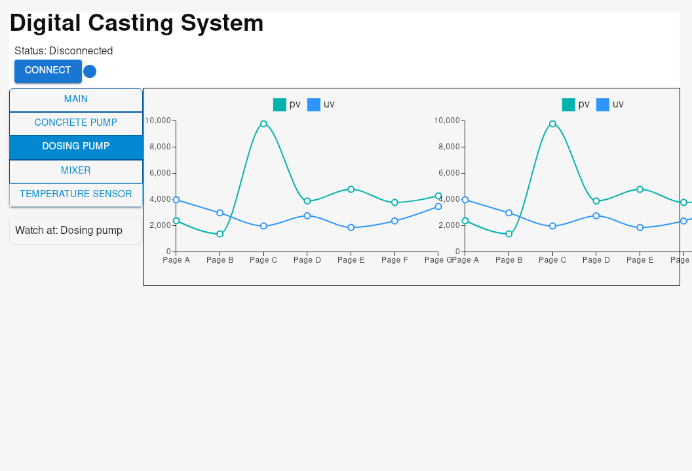

# Digital Casting System Control App

## Description

This app use to control the casting process.
The app build use `python` for the backend, `react` for the frontend, and build with `tauri` for the desktop app.

### Usage

> [!NOTE]: WORK IN PROGRESS
 

### Development setup

#### Prerequisites

- setup Tauri
check the [Tauri](https://tauri.app/start/prerequisites/#system-dependencies) documentation for more information

```bash
# system dependencies for WSL/Debian
sudo apt update
sudo apt install libwebkit2gtk-4.1-dev \
build-essential \
curl \
wget \
file \
libxdo-dev \
libssl-dev \
libayatana-appindicator3-dev \
librsvg2-dev

# install rust
curl --proto '=https' --tlsv1.2 https://sh.rustup.rs -sSf | sh
which rust
which cargo
```

- setup uv
- setup bun

#### Backend

```bash
uv venv
````

#### Frontend

```bash
bun create tauri-app@latest my-tauri-app -- --template react-ts
bun install
```

```bash
# dev mode
bun run tarui dev

# build
bun run tarui build
```

### folder structure

```bash
```
